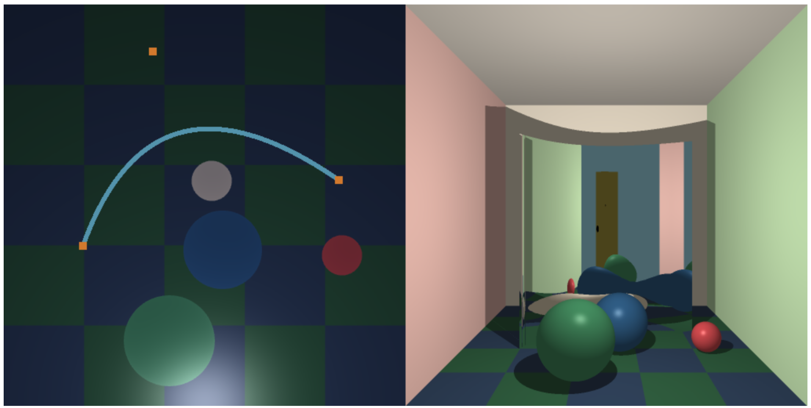

## Project 5 - Bezier Funhouse
## Gabe Howland & Zeke Dawson

This project was done in collaboration with Zeke Dawson. Code is a combination of both our work.

Overall, the javascript was pretty painless, while the C felt like a trial by fire. I think the main reason is a lack of console debugging, but other workarounds were done. I attempted to place spheres along the path of the bezier curve and I found that all the panels were stuck between CP0 and CP1. After correcting that, and changing some of the mirror calculations with Zeke, the above image is the final result.

The mirror looks good, Zeke did the calculations for the affine combination of normals to get a true "smooth" effect. I still think there is something off with the way the mirror is rendering, but it passes the naked eye test and that is good enough for me.

The shadow was pretty painless, I had to move some functions around, notably `rayPanelIntersect()` which now lives right below `rayPlaneIntersect()` in order to prevent errors caused by function order. If I had my preferance, I would move `rayHitsBezierBefore()` below all the bezier calculations, but that felt too much like cheating (so instead I copied the vast majority of the bezierIntersect code).

Had I had more time, and had GLSL been a more forgiving library, I would have maybe attempted the extra challenges, but I may look at it later in life.