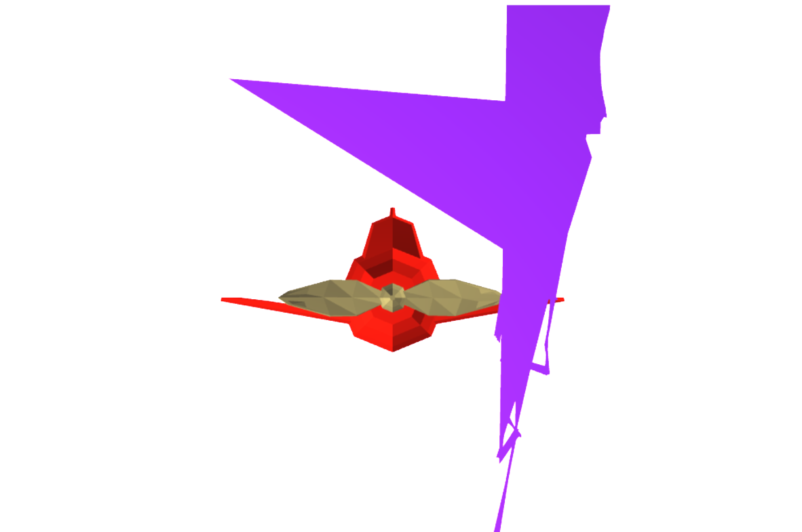
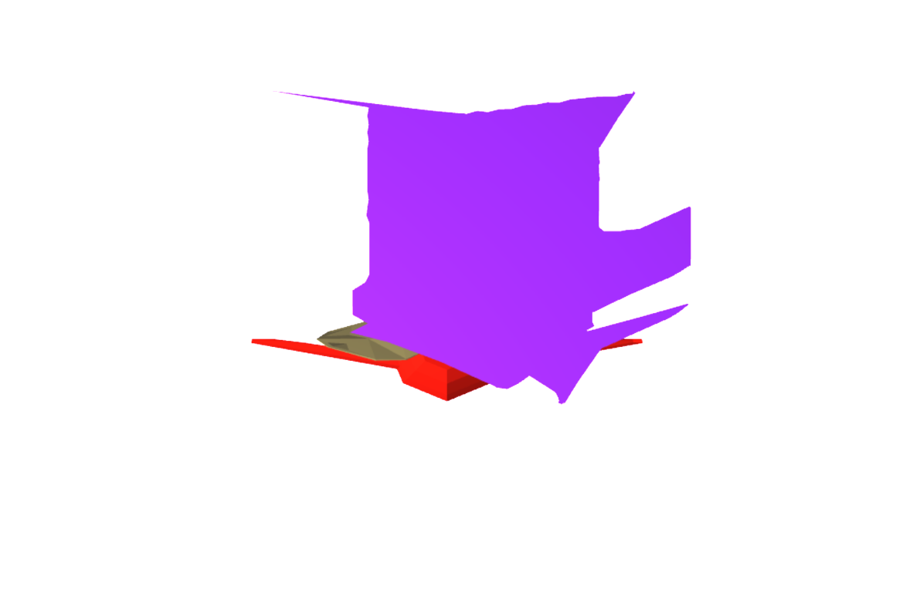

# Project7: Sheet to the Wind

I enjoyed following the instructions! The steps were relatively straightforward. I had some issues with my sheet that I assume were caused by the way I construct my springs. As it stands, the assignment is incomplete.git

Everything else felt relatively straightforward, but as it stands submitted, there is this error that exists. Unfortunately the end of the semester hit like a truck and I was not able to implement flap.

Below are some pictures of weird-looking cloths during the process. I also have some videos that are in the `/pics` folder. I recieved some help from Zeke and Sam, who helped me conceptualize how some components were to be crafted.

